# React and Redux - Test units

Testing code is probably one of the most important things to do in software engineering. Testing ensures the quality of what we are building. There are many ways to test code, from end-to-end testing (manual testing) to unit testing (component testing in React)

In Agile frameworks, automated testing can be grouped into a testing pyramid. A testing pyramid illustrates when we should use one testing method versus another. The pyramid shows that many unit-snapshot tests can be used to validate one integration test, and many integration tests can be used to validate one manual test. At the peak of the pyramid, we have an end-to-end test: manual testing of the whole application. The idea of choosing what type of tests should be used is important, as we may be testing the same thing in two or three different levels of the pyramid.

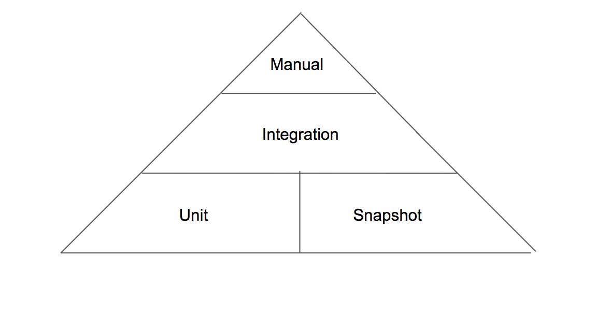

* Manual testing is slow and unsustainable. This type of testing works for our front-end applications because it mimics how the user will interact with our application. The problem with this testing is that it is expensive to maintain (any minor UI change may break the tests, because these tests are normally done with Selenium, a web browser emulator) and the time to develop one of this tests may be high. It’s important to note that we don’t usually use this type of testing in front-end applications due to high costs.

* Integration testing may be good to test connections between components and finding bugs in these liaisons. For example, let’s imagine we want to test if a parent component passes specific props to a child whenever a user clicks a button. The cost of maintaining and doing these tests is not very high and will test parts that we don’t test with unit tests.

* Unit/Snapshot testing is probably the easiest way to test components. We only focus on one isolated item and its logic. If we follow the presentation-functional components division, it will even be easier to test this. For presentational components, we give the props to the component and expect a specific render (could be a good use case for snapshot). In functional testing, the tests can be more tricky. We need to mock a redux store to create user actions, and we expect redux actions to be called by the mocked store while we simulate events.

* As rule of thumb for frontend development, start with unit/snapshot testing. Proceed to an integration test only if necessary. Try to avoid manual/UI testing. We can use Jest as our main testing tool for the first two steps of the pyramid.

## Before writing Tests
Three steps when you want to start writing tests: 
* Looking and indentify every indivudual part of the application
    * Every Component
    * Every Reducer
    * Every Action Creator
* Search and Define the purpose for every part of the application
* describe the test to test or verify a functionality 

## The App
### Components Division
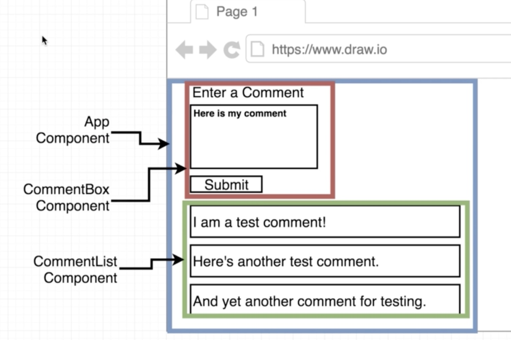
### It will use Redux for the state management
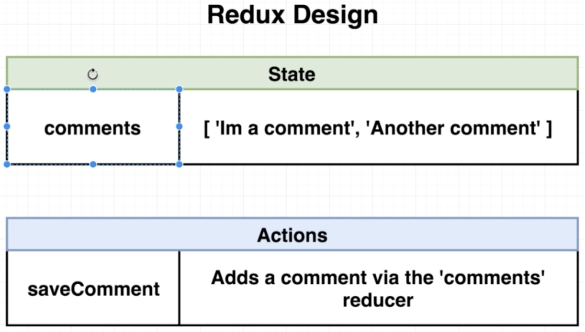
### Testing Design
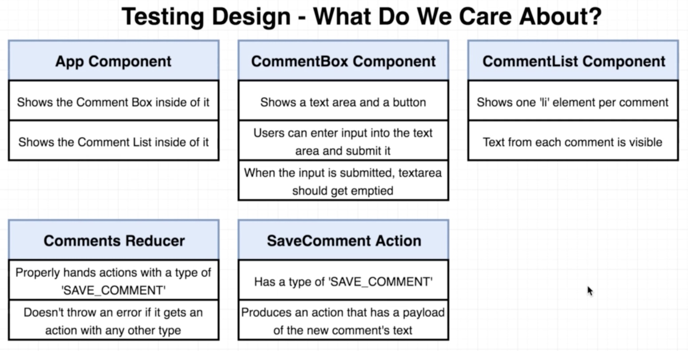

---

## Create-React-App uses JEST as its test runner
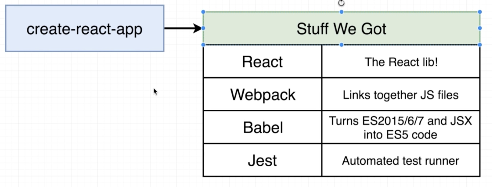

---

## JEST
* Jest is a testing framework created by Facebook. Facebook uses it to test JavaScript and React code
* It was created under the premise of performance, features and adaptability
* Jest provides an integrated “zero-configuration” experience, This is a differentiator from other popular testing frameworks like Mocha
* I has a lot of features :
    * Instant Feedback: Immersive Watch mode only runs test files related to changed files.
    * Fast and sandboxed: It runs parallel tests across workers, and buffers console messages and prints them together.
    * Snapshot Testing: Capture snapshots of React trees or other serializable values to simplify testing and analyze how state changes over time.
    * Built-in code coverage reports: Supports —-coverage for bringing out of the box coverage reports.
    * Zero configuration
* Jest is a Node-based runner. This means that the tests always run in a Node environment and not in a real browser. This lets us enable fast iteration speed and prevent flakiness.
* While Jest provides browser globals such as window thanks to jsdom, they are only approximations of the real browser behavior. Jest is intended to be used for unit tests of your logic and your components rather than the DOM quirks.
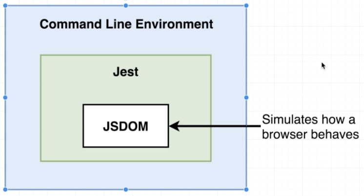

___

## Process of Jest test runner
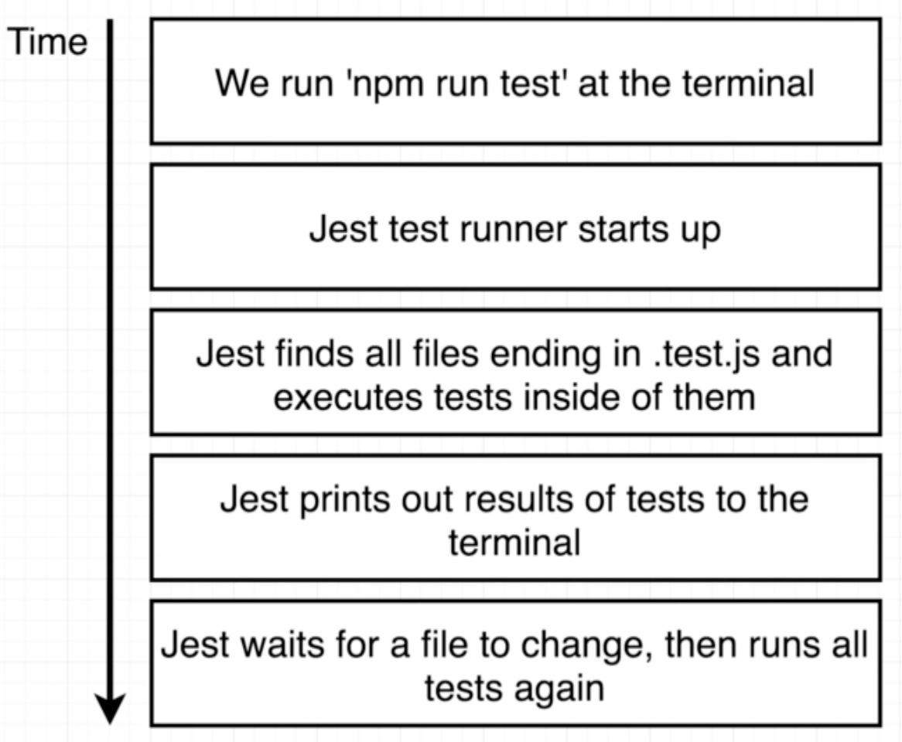

---

## Filename Conventions
Jest will look for test files with any of the following popular naming conventions:

* Files with .js suffix in ```__tests__``` folders.
* Files with .test.js suffix.
* Files with .spec.js suffix.
* The .test.js / .spec.js files (or the ```__tests__``` folders) can be located at any depth under the src top level folder.

It is recommend to put the test files (or ```__tests__``` folders) next to the code they are testing so that relative imports appear shorter. For example, if App.test.js and App.js are in the same folder, the test just needs to import App from './App' instead of a long relative path. Colocation also helps find tests more quickly in larger projects.

---

## Test Structure

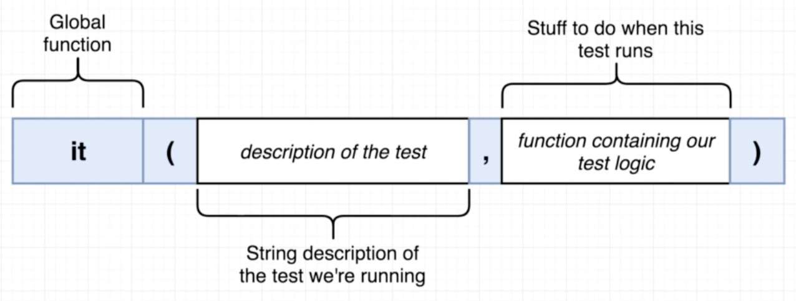

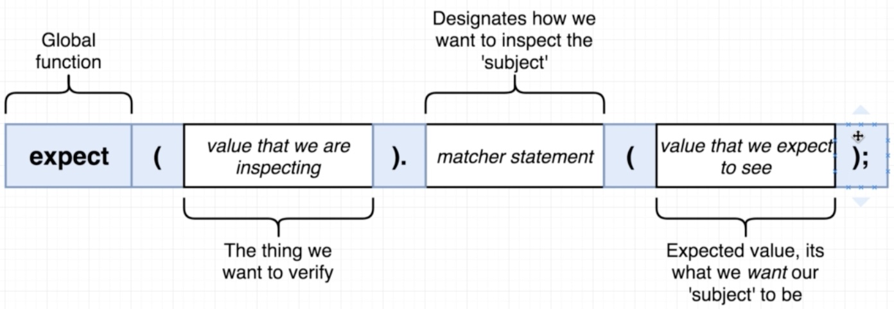

___

### First test: Test if the title of the app is exactly ```React and Redux Unit Testing Application```
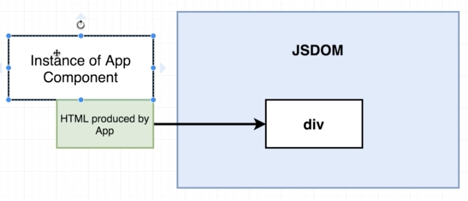
App.js
```javascript
import React from 'react';
import CommentBox from './CommentBox';
import CommentList from './CommentList';

const App = () => {
    return (
        <div className="app">
            <div className="app-title">
                React and Redux Unit Testing Application
            </div>
            <CommentBox />
            <CommentList />
        </div>
    );
};
```

App.test.js

```jsx
import React from 'react';
import ReactDOM from 'react-dom';
import App from './App';

it('should have the exact title', () => {
  const div = document.createElement('div');
  ReactDOM.render(<App />, div);
  // imprime tous le code HTML rendu
  expect(div.innerHTML).toContain(
      'React and Redux Unit Testing Application');
  ReactDOM.unmountComponentAtNode(div);
});
````

---
### Using JEST Matchers
#### Common Matcher
* toBe  not toBe
```javascript
test('two plus two is four', () => {
  expect(2 + 2).toBe(4);
  expect(2 + 2).not.toBe(5);
});
test('two plus two is four', () => {
  expect(2 + 2).not.toBe(5);
});
```
* toEqual for objets equality
```javascript
test('object assignment', () => {
  const data = {one: 1};
  data['two'] = 2;
  expect(data).toEqual({one: 1, two: 2});
});
```
#### Truthiness
* toBeNull matches only null
* toBeUndefined matches only undefined
* toBeDefined is the opposite of toBeUndefined
* toBeTruthy matches anything that an if statement treats as true
* toBeFalsy matches anything that an if statement treats as false
```javascript
test('null', () => {
  const n = null;
  expect(n).toBeNull();
  expect(n).toBeDefined();
  expect(n).not.toBeUndefined();
  expect(n).not.toBeTruthy();
  expect(n).toBeFalsy();
});

test('zero', () => {
  const z = 0;
  expect(z).not.toBeNull();
  expect(z).toBeDefined();
  expect(z).not.toBeUndefined();
  expect(z).not.toBeTruthy();
  expect(z).toBeFalsy();
});
```
#### Numbers
Most ways of comparing numbers have matcher equivalents
```javascript
test('two plus two', () => {
  const value = 2 + 2;
  expect(value).toBeGreaterThan(3);
  expect(value).toBeGreaterThanOrEqual(3.5);
  expect(value).toBeLessThan(5);
  expect(value).toBeLessThanOrEqual(4.5);

  // toBe and toEqual are equivalent for numbers
  expect(value).toBe(4);
  expect(value).toEqual(4);
});
```
For floating point equality, use toBeCloseTo instead of toEqual, because you don't want a test to depend on a tiny rounding error.
```javascript
test('adding floating point numbers', () => {
  const value = 0.1 + 0.2;
  //expect(value).toBe(0.3); This won't work because of rounding error
  expect(value).toBeCloseTo(0.3); // This works.
});
```
#### Strings
You can check strings against regular expressions with toMatch:
```javascript
test('there is no I in team', () => {
  expect('team').not.toMatch(/I/);
});

test('but there is a "stop" in Christoph', () => {
  expect('Christoph').toMatch(/stop/);
});
```
#### Arrays
You can check if an array contains a particular item using toContain:
```javascript
const shoppingList = [
  'diapers',
  'kleenex',
  'trash bags',
  'paper towels',
  'beer',
];

test('the shopping list has beer on it', () => {
  expect(shoppingList).toContain('beer');
});
```
#### Exceptions
If you want to test that a particular function throws an error when it's called, use toThrow
```javascript
function compileCode() {
  throw new ConfigError('you are using the wrong compiler');
}

test('compiling goes as expected', () => {
  expect(compileAndroidCode).toThrow();
  expect(compileAndroidCode).toThrow(ConfigError);

  // You can also use the exact error message or a regexp
  expect(compileAndroidCode).toThrow('you are using the wrong compiler');
  expect(compileAndroidCode).toThrow(/wrong/);
});
```
___

### Using JEST to test assynchronous code

___

### Setup and Teardown
#### Repeating Setup For Many Tests
```javascript
beforeEach(() => {
  initializeCityDatabase();
});

afterEach(() => {
  clearCityDatabase();
});

test('city database has Vienna', () => {
  expect(isCity('Vienna')).toBeTruthy();
});

test('city database has San Juan', () => {
  expect(isCity('San Juan')).toBeTruthy();
});
```
beforeEach and afterEach can handle asynchronous code in the same ways that tests can handle asynchronous code - they can either take a done parameter or return a promise. For example, if initializeCityDatabase() returned a promise that resolved when the database was initialized, we would want to return that promise:

```javascript
beforeEach(() => {
  return initializeCityDatabase();
});
```
#### One-time Setup
In some cases, you only need to do setup once, at the beginning of a file. This can be especially bothersome when the setup is asynchronous, so you can't just do it inline. Jest provides beforeAll and afterAll to handle this situation.

For example, if both initializeCityDatabase and clearCityDatabase returned promises, and the city database could be reused between tests, we could change our test code to:
```javascript
beforeAll(() => {
  return initializeCityDatabase();
});

afterAll(() => {
  return clearCityDatabase();
});

test('city database has Vienna', () => {
  expect(isCity('Vienna')).toBeTruthy();
});

test('city database has San Juan', () => {
  expect(isCity('San Juan')).toBeTruthy();
});
```
#### Scoping
By default, the before and after blocks apply to every test in a file. You can also group tests together using a describe block. When they are inside a describe block, the before and after blocks only apply to the tests within that describe block.

For example, let's say we had not just a city database, but also a food database. We could do different setup for different tests:

```javascript
// Applies to all tests in this file
beforeEach(() => {
  return initializeCityDatabase();
});

test('city database has Vienna', () => {
  expect(isCity('Vienna')).toBeTruthy();
});

test('city database has San Juan', () => {
  expect(isCity('San Juan')).toBeTruthy();
});

describe('matching cities to foods', () => {
  // Applies only to tests in this describe block
  beforeEach(() => {
    return initializeFoodDatabase();
  });

  test('Vienna <3 sausage', () => {
    expect(isValidCityFoodPair('Vienna', 'Wiener Schnitzel'))
    .toBe(true);
  });

  test('San Juan <3 plantains', () => {
    expect(isValidCityFoodPair('San Juan', 'Mofongo')).toBe(true);
  });
});
```
Note that the top-level beforeEach is executed before the beforeEach inside the describe block. It may help to illustrate the order of execution of all hooks
```javascript
beforeAll(() => console.log('1 - beforeAll'));
afterAll(() => console.log('1 - afterAll'));
beforeEach(() => console.log('1 - beforeEach'));
afterEach(() => console.log('1 - afterEach'));
test('', () => console.log('1 - test'));
describe('Scoped / Nested block', () => {
  beforeAll(() => console.log('2 - beforeAll'));
  afterAll(() => console.log('2 - afterAll'));
  beforeEach(() => console.log('2 - beforeEach'));
  afterEach(() => console.log('2 - afterEach'));
  test('', () => console.log('2 - test'));
});
```
results:
```
// 1 - beforeAll
// 1 - beforeEach
// 1 - test
// 1 - afterEach
// 2 - beforeAll
// 1 - beforeEach
// 2 - beforeEach
// 2 - test
// 2 - afterEach
// 1 - afterEach
// 2 - afterAll
// 1 - afterAll
```
___

## Enzyme
* Enzyme is a JavaScript Testing utility for React that makes it easier to assert, manipulate, and traverse your React Components' output
* Jest and Enzyme are different but complimentary tools, that integrate well together to provide flexible and creative testing abilities. 
* Enzyme, created by Airbnb, adds some great additional utility methods for rendering a component (or multiple components), finding elements, and interacting with elements.
* We usually use :
    * Jest as the test runner, assertion library, and mocking library
    * Enzyme to provide additional testing utilities to interact with elements
### Setup Enzyme
* Install the dependencies
```yarn add enzyme enzyme-adapter-react-16```
* We add on the root of the ```/src```folder a file with the exact name ```setupTests.js``` This file is the first file executed by JEST before any unit testing
* We configure Enzyme with new adapter


setupTests.js
```javascript
import Enzyme from 'enzyme';
import Adapter from 'enzyme-adapter-react-16';

Enzyme.configure({ adapter: new Adapter() });
```
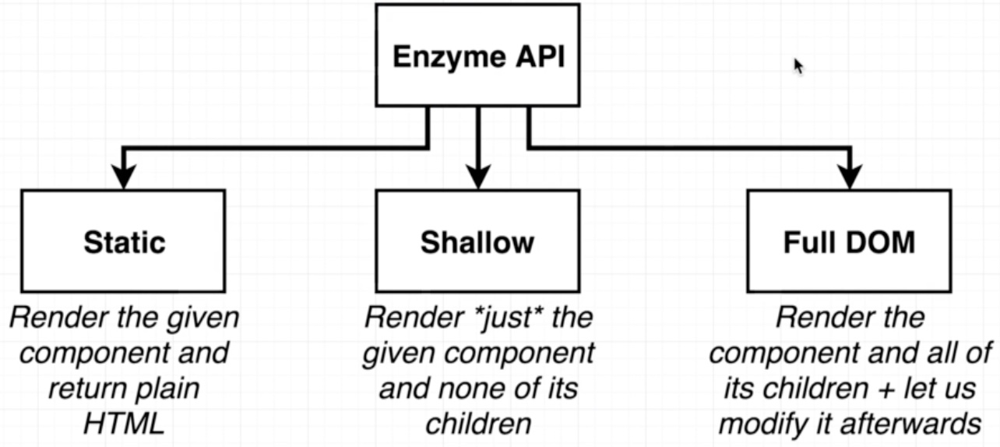

### Mounting (Full DOM)
* Full DOM rendering including child components
* Ideal for use cases where you have components that may interact with DOM API, or use React lifecycle methods in order to fully test the component
* As it actually mounts the component in the DOM .unmount() should be called after each tests to stop tests affecting each other
* Allows access to both props directly passed into the root component (including default props) and props passed into child components

```javascript
import React from 'react';
import sinon from 'sinon';
import { expect } from 'chai';
import { mount } from 'enzyme';

import Foo from './Foo';

describe('<Foo />', () => {
  it('allows us to set props', () => {
    const wrapper = mount(<Foo bar="baz" />);
    expect(wrapper.props().bar).to.equal('baz');
    wrapper.setProps({ bar: 'foo' });
    expect(wrapper.props().bar).to.equal('foo');
  });

  it('simulates click events', () => {
    const onButtonClick = sinon.spy();
    const wrapper = mount((
      <Foo onButtonClick={onButtonClick} />
    ));
    wrapper.find('button').simulate('click');
    expect(onButtonClick).to.have.property('callCount', 1);
  });

  it('calls componentDidMount', () => {
    sinon.spy(Foo.prototype, 'componentDidMount');
    const wrapper = mount(<Foo />);
    expect(Foo.prototype.componentDidMount).to.have.property('callCount', 1);
    Foo.prototype.componentDidMount.restore();
  });
});
```

### Shallow
* Renders only the single component, not including its children. This is useful to isolate the component for pure unit testing. It protects against changes or bugs in a child component altering the behaviour or output of the component under test
* As of Enzyme 3 shallow components do have access to lifecycle methods by default
* Cannot access props passed into the root component (therefore also not default props), but can those passed into child components, and can test the effect of props passed into the root component. This is as with shallow ```<MyComponent />```, you're testing what ```MyComponent``` renders - not the element you passed into ```shallow```

```javascript
import React from 'react';
import { expect } from 'chai';
import { shallow } from 'enzyme';
import sinon from 'sinon';

import MyComponent from './MyComponent';
import Foo from './Foo';

describe('<MyComponent />', () => {
  it('renders three <Foo /> components', () => {
    const wrapper = shallow(<MyComponent />);
    expect(wrapper.find(Foo)).to.have.lengthOf(3);
  });

  it('renders an `.icon-star`', () => {
    const wrapper = shallow(<MyComponent />);
    expect(wrapper.find('.icon-star')).to.have.lengthOf(1);
  });

  it('renders children when passed in', () => {
    const wrapper = shallow((
      <MyComponent>
        <div className="unique" />
      </MyComponent>
    ));
    expect(wrapper.contains(<div className="unique" />)).to.equal(true);
  });

  it('simulates click events', () => {
    const onButtonClick = sinon.spy();
    const wrapper = shallow(<Foo onButtonClick={onButtonClick} />);
    wrapper.find('button').simulate('click');
    expect(onButtonClick).to.have.property('callCount', 1);
  });
});
```

### Render (Static)
* Renders to static HTML, including children
* Does not have access to React lifecycle methods
* Less costly than ```mount``` but provides less functionality

```javascript
import React from 'react';
import { expect } from 'chai';
import { render } from 'enzyme';

import Foo from './Foo';

describe('<Foo />', () => {
  it('renders three `.foo-bar`s', () => {
    const wrapper = render(<Foo />);
    expect(wrapper.find('.foo-bar')).to.have.lengthOf(3);
  });

  it('renders the title', () => {
    const wrapper = render(<Foo title="unique" />);
    expect(wrapper.text()).to.contain('unique');
  });
});
```
---
## Second test: Test if the ```<App />``` has two components ```<CommentBox />```and ```<CommentList />```

```javascript
import React from 'react';
import ReactDOM from 'react-dom';
import App from './App';
import { shallow } from 'enzyme';
import CommentBox from './CommentBox';
import CommentList from './CommentList';

it('should have the exact title', () => {
  const div = document.createElement('div');
  ReactDOM.render(<App />, div);
  expect(div.innerHTML).toContain(
      'React and Redux Unit Testing Application');
  ReactDOM.unmountComponentAtNode(div);
});

// wrapped = wrapped component
let wrapped; 

beforeEach(() => {
    wrapped = shallow(<App />);
});
it('shows one comment box', () => {
    expect(wrapped.find(CommentBox).length).toEqual(1);
});

it('shows one comment list', () => {
  expect(wrapped.find(CommentList).length).toEqual(1);
});
```
---
## Third test: Test if the ```<CommentBox />``` 
* Shows a TextArea and a Button
* Users can enter input to the TextArea and submit it
* When the input is submitted, TextArea should get emptied

CommentBox.js
```javascript
import React, {Component} from 'react';

class CommentBox extends Component {
    state = { comment: '', comments: []};
    handleChange = event => {
        this.setState({ comment: event.target.value});
    }
    handleSubmit = event => {
        event.preventDefault();
        this.setState({comment: ''});
    }
    render() {
        return(
            <div className="comment-box">
            <form onSubmit={this.handleSubmit}>
                <h4>Add a comment</h4>
                <textarea 
                    onChange={this.handleChange}
                    value={this.state.comment}/>
                <div>
                <button type="submit">Submit comment</button>
                </div>
            </form>
            </div>
        );
    }
}
export default CommentBox;
```
* Choosing an Enzyme Handler (Static, Shallow, FullDom)
* For the purpose of the test, Shallow is ok because CommentBox has not children components
* To get some variety of experience we're going to arbitrarily decide to use the FullDOM render
#### Shows a text area and a button
```javascript
import React from 'React';
import { mount } from 'enzyme';

import CommentBox from './CommentBox';

let wrapped; 

beforeEach(() => {
    wrapped = mount(<CommentBox />);
});
afterEach(() => {
    wrapped.unmount();
});

it('has a text area and a button', () => {
    expect(wrapped.find('textarea').length).toEqual(1);
    expect(wrapped.find('button').length).toEqual(1);
});
```
* Simulating a change event
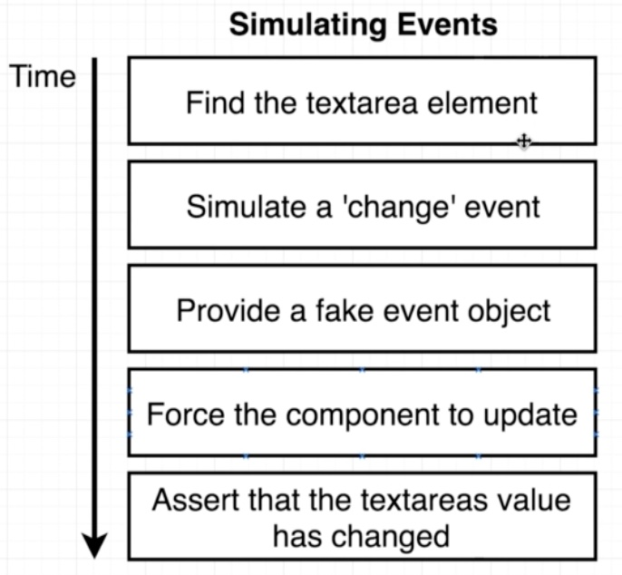
  * Find the textarea element ```wrapped.find('textarea')```
  * Simulate a 'change' event: methode simulate that takes two arguments, event (HTML name of the event) and
  * Provide fake event object:  ```mock``` object argument to the function ```handleSubmit(...)``` 
  ```javascript
  .simulate('change', {target: { value: 'new comment' }});
  ```
  * Force the component to update: because setting the state followed by component update is asynchrone we force to update```wrapped.update();```
  * Assert that the textareas value has changed: we take the prop name value and assert on it
  ```javascript
  expect(wrapped.find('textarea').prop('value'))
  .toEqual('new comment');
  ```

```javascript
it('can enter input to the text area and submit it', () => {
    wrapped.find('textarea').simulate('change', {
        target: { value: 'new comment' }
    });
    wrapped.update();
    expect(wrapped.find('textarea')
    .prop('value'))
    .toEqual('new comment');
});
```
* When the input is submitted, TextArea should get emptied
```javascript
it('should empty the text area when user submit', () => {
    wrapped.find('textarea').simulate('change', {
        target: { value: 'new comment' }
    });
    wrapped.update();
    wrapped.find('form').simulate('submit');
    wrapped.update();
    expect(wrapped.find('textarea')
    .prop('value'))
    .toEqual('c');
});
```
## APP: Wiring Redux with CommentBox
* We added Root, a functionnal component where we put the provider tag and the store created on it
* This Root can have children like ```</App>```
* We did this to use the Root to connect isolated component for testing purposes

root.js
```javascript
import React from 'react';
import { Provider } from 'react-redux';
import { createStore } from 'redux';
import reducers from './reducers';

export default props => {
    return(
        <Provider store={createStore(reducers, {})}>
            {props.children}
        </Provider>
    );
}
```
---
index.js
```javascript
import React from 'react';
import ReactDOM from 'react-dom';
import './index.css';
import App from './components/App';
import Root from './root';

ReactDOM.render(
    <Root>
        <App />
    </Root>
    , document.getElementById('root'));
```
---
App.js
```javascript
import React from 'react';
import CommentBox from './CommentBox';
import CommentList from './CommentList';

const App = () => {
    return (
        <div className="app">
            <div className="app-title">React and Redux Unit Testing Application</div>
            <CommentBox />
            <CommentList />
        </div>
    );
};

export default App;
```
---
commentBox.js
```javascript
import React, {Component} from 'react';
import { connect } from 'react-redux';
import { saveComment } from '../actions'

class CommentBox extends Component {
    state = { comment: '', comments: []};
    handleChange = event => {
        this.setState({ comment: event.target.value});
    }
    handleSubmit = event => {
        event.preventDefault();
        this.props.saveComment(this.state.comment);
        this.setState({comment: ''});
    }
    render() {
        return(
            <div className="comment-box">
            <form onSubmit={this.handleSubmit}>
                <h4>Add a comment</h4>
                <textarea 
                    onChange={this.handleChange}
                    value={this.state.comment}/>
                <div>
                <button type="submit">Submit comment</button>
                </div>
            </form>
            </div>
        );
    }
}
const mapDispatchToProps = {
    saveComment
};
export default connect(null, mapDispatchToProps)
(CommentBox);
```
---
actionsType.js
```javascript
export const SAVE_COMMENT = 'SAVE_COMMENT';
```
---
action/index.js
```javascript
import { SAVE_COMMENT } from './actionTypes';

export const saveComment = comment => {
    return {
        type: SAVE_COMMENT,
        payload: comment
    }
}
```
reducers/index.js
```javascript
import { combineReducers} from 'redux';
import commentsReducer from './comments';

export default combineReducers({
    comments: commentsReducer
});
```
## Test 5: Test the Action and the Reducer
actions/index.test.js
```javascript
import { saveComment} from './index';
import { SAVE_COMMENT } from './actionTypes';

describe('Action Save Comment', () => {

    it('has the correct type', () => {
        const action = saveComment();
        expect(action.type).toEqual(SAVE_COMMENT);
    });

    it('has the correct payload', () => {
        const action = saveComment('New Comment');
        expect(action.payload).toEqual('New Comment');
    });

});
```
---
reducers/comments.test.js
```javascript
import commentsReducer from './comments';
import { SAVE_COMMENT } from '../actions/actionTypes';

it('Handle actions of type SAVE_COMMENT', () => {
    const action = {
        type: SAVE_COMMENT,
        payload: 'new comment'
    }
    const newState = commentsReducer([], action);
    expect(newState).toEqual(['new comment']);
})

it('handles action with unknown type', () => {
    const newState = commentsReducer([], { type: 'SDFGD' });
    expect(newState).toEqual([]);
})
```

## APP: Wiring CommentList
* Before we had an empty object for the initial state
* On the new ```root.js``` we destructure the propos and we are adding intialState if it exists otherwise ```={}````
* This is done for initialising the state without action creator

old root.js
```javascript
export default props => {
    return(
        <Provider store={createStore(reducers, {})}>
            {props.children}
        </Provider>
    );
}
```
root.js
```javascript
import React from 'react';
import { Provider } from 'react-redux';
import { createStore } from 'redux';
import reducers from './reducers';

export default ({ children, initialState = {} }) => {
    return(
        <Provider store={createStore(reducers, initialState)}>
            {children}
        </Provider>
    );
}
```
CommentList.js
```javascript
import React from 'react';
import { connect } from 'react-redux';

const Comment = props => (
    <li key={props.index}>{props.comment}</li>      
);
const CommentList = props => (
        <div className="comment-list">
            <h4>Comment List</h4>
            <ul>{props.comments.map(
                (comment, index) => 
                <Comment 
                    comment={comment} 
                    key={index} 
                    index={index} />)}
            </ul>
        </div>
);
const mapStateToProps = state => {
    return { comments: state.comments }
}
export default connect(mapStateToProps, null)(CommentList);
```
## Test 6: Test CommentList Component
* ```wrapped.render()``` returns a cherio object then we use utlity function like ```.text()```
```javascript
import React from 'react';
import { mount } from 'enzyme';

import CommentList from './CommentList';
import Root from '../root';

let wrapped;
beforeEach(() => {
  const initialState = {
    comments: ['Comment 1', 'Comment 2']
  };
  wrapped = mount(
    <Root initialState={initialState}>
      <CommentList />
    </Root>
  );
});

it('creates one LI per comment', () => {
  expect(wrapped.find('li').length).toEqual(2);
});

it('shows the text for each comment', () => {
  expect(wrapped.render().text()).toContain('Comment 1');
  expect(wrapped.render().text()).toContain('Comment 2');
});
```
## APP: FETCH COMMENTS
* we add this to actions/actionTypes.js
```javascript
export const FETCH_COMMENTS = 'FETCH_COMMENTS';
```
* we add to CommentBox: remember that ```this.props.fetchComment```without `()` because we dont't want to execute as it render
```javascript
<button
    onClick={this.props.fetchComments}
    className="fetch-comments">Fetch Comments</button>
```
* we add to the action/index.js
```javascript
export const fetchComments = () => {
    const response = axios.get(
        'http://jsonplaceholder.typicode.com/comments');
    return {
        type: FETCH_COMMENTS,
        payload: response
    }
}
```
* we add to the reducers/comments.js
```javascript
case FETCH_COMMENTS :
const comments = action.payload
    .data.map(comment=>comment.name)
    return [...state, ...comments];
```

## Integration testing
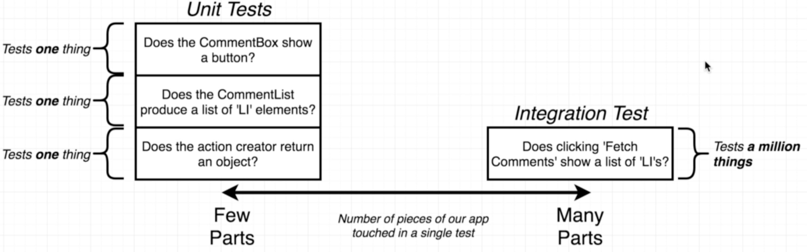
* add more text to explain the difference between unit and integration

## Test 7: Integration testing of fetch comments

## Planning: 

OK - Part 1: 12 séances 28mn + 1h AC = 1h30mn

OK - Part 2: de 12 à 22 53mn + 2h AC voir la doc de JEST = 3h de travail

OK - Part 3: de 23 à 37 63mn + 2h AC voir la doc de Enzyme = 3h de travail

OK - Part 4: de 37 à 46 46mn + 1h45mn = 2h30mn

* Part 5: de 47 à 51 72mn + 2h45mn = 1séance de 2.5h de travail

* Part 6: de 52 à 63 72mn + 2h45mn = 1séance de 2.5h de travail


* Total 14h de travail

